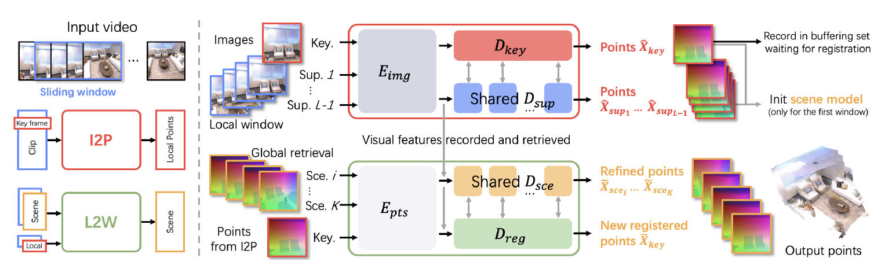
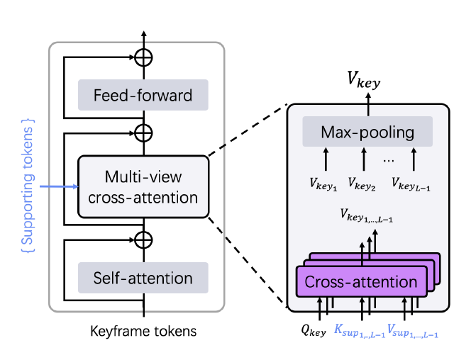
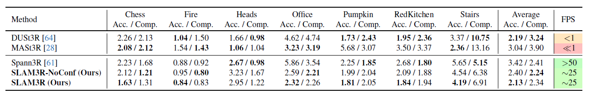
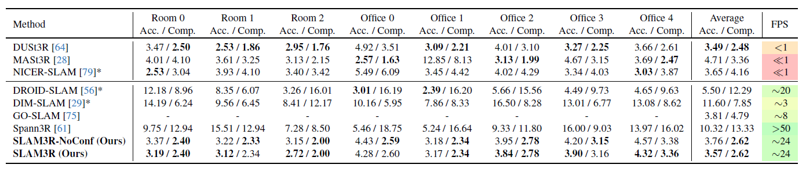
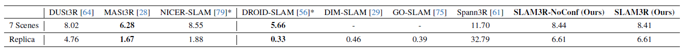

# SLAM3R: Real-Time Dense Scene Reconstruction from Monocular RGB Videos

This repository contains a study of the paper [SLAM3R: Real-Time Dense Scene Reconstruction from Monocular RGB Videos](https://openaccess.thecvf.com/content/CVPR2025/papers/Liu_SLAM3R_Real-Time_Dense_Scene_Reconstruction_from_Monocular_RGB_Videos_CVPR_2025_paper.pdf) by Yuzheng Liu, Siyan Dong, Shuzhe Wang, Yingda Yin, Yanchao Yang, Qingnam Fan and  Baoquan Chen. This paper is a CVPR 2025 highlight paper.

The following is a summary of the paper along with some images which were obtained from the paper. Please refer to the original paper for more details.

This is not an official implementation of the paper. All model weights and code are from the original repository.

## Introduction

SLAM3R is a novel real-time end-to-end dense 3D reconstruction system that uses RGB videos to directly predict 3D pointmaps in a unified coordinate system through feed-forward neural networks.

Previous techniques typically require offline processing which limits their ability to be used in real-time applications. Dense scene reconstruction systems have been developed. However, these all short in terms of accuracy or completeness or they require depth sensors. monocular SLAM (Simultaneous Localization and Mapping) systems have been proposed, however these come at the cost of reduced runtime efficiency. The goal of this research paper is to develop a model which satisfies the three criteria: **reconstruction accuracy**, **completeness** and **runtime efficiency**.

The network consists of two main components:

1. **Image-to-points (I2P)**: Reconstructs local geometry from a sliding window

2. **Local-to-World (L2W)**: Registers local reconstructions to build a globally consistent 3D scene

## Related Work

* Traditional offline approaches: Classical approaches first determine camera parameters using structure from motion (SfM) followed by dense 3D point triangulation using multi-view stereo (MVS). Neural implicit and 3D Gaussian representations have been applied to enhance the quality of dense reconstruction. Due to offline processing, these methods are not suitable for real-time applications.

* Dense SLAM: Early approaches prioritized real-time performance but produced only sparse structures of the scene. Dense SLAM approaches incorporate detailed scene geometry information to improve pose estimation. More recent approaches monocular dense SLAM systems have been proposed. All methods alternate between solving for camera poses and estimating the scene representation.

* End-to-end dense 3D reconstruction: Recent works have explored end-to-end learning-based approaches for dense 3D reconstruction. These methods typically use deep neural networks to directly predict 3D structures from input images. Dust3R is purely end-to-end without relying on camera parameters. MAST3R adds a match head. Spann3R adds spatial memory by performing incremental scene reconstruction in a unified coordinate system.

## Method

The goal of SLAM3R is to construct dense 3D pointcloud $P \in \mathbb{R}^{M \times 3}$ from a sequence of monocular RGB images $\{I \in \mathbb{R}^{H \times W \times 3}\}_{i=1}^{N}$, where $M$ is the number of points in the pointcloud. The focus is to:

* Maximize 3D point recovery for completeness
* Improve the accuracy of each recovered point
* Preserve real-time performance

The system directly predicts point maps without explicitly predicting camera parameters.

First, a sliding window of length $L$ is applied to obtain short clips $W \in \mathbb{R}^{L \times H \times W \times 3}$. The I2P network processes each window $W_i$ to recover local 3D pointmaps. A keyframe is selected for each window from which a reference coordinate system is defined and the stride is set to 1 so that each frame can be the keyframe of a window. For global scene reconstruction, the world coordinate system is initialized with the first window and uses the reconstructed frames (image and local point map produced by the I2P) as input for the L2W model. The L2W model incrementally registers these local reconstructions into a unified global 3D coordinate system

### Inner-Window Local Reconstruction

The I2P model infers dense 3D pointmaps for every pixel of a keyframe. By default the keyframe is the middle image of the window while the remaining images serve as supporting images.

This model has a multi-branch vision transformer (ViT) backbone consisting of a shared encoder, two decoders for keyframe and supporting frames and a point regression head for final prediction.

Image encoder: Each frame $I_i$ is encoded to obtain token representations $F_i \in \mathbb{R}^{T \times d}$, where $T$ is the number of tokens and $d$ is the token dimension. There are $m$ encoder blocks each containing self-attention and feed-forward layers. Output is divided into 2 parts for the key frame and supporting frames.

Keyframe decoder: Consists of $n$ ViT decoder blocks, each containing self-attention, cross-attention and feed-forward layers. The model uses a novel multi-view cross-attention to combine information from different supporting frames. The decoder takes $F_{key}$ as input for self-attention for the keyframe to reason about itself and performs cross-attention between $F_{key}$ and all supporting frame features $\{F_{sup}\}_{i=1}^{L-1}$ to get geometric information from other frames. The architecture uses multi-view cross-attention, meaning there is a seperate cross-attention for each supporting frame.

For each cross-attention layer, queries are taken from $F_{key}$, while keys and values are extracted from the supporting tokens $\{F_{sup}\}_{i=1}^{L-1}$. A max pooling layer aggregates features after cross-attention.

$$G_{key} = D_{key}(F_{key}, \{F_{sup}\}_{i=1}^{L-1})$$

where $D_{key}$ is the keyframe decoder and $G_{key} \in \mathbb{R}^{T \times d}$ is the decoded keyframe tokens.

Supporting decoder: This complements the keyframe decoder. It inherits the DUSt3R architecture. All supporting frames share the same supporting decoder weights. It consists of self-attention and cross-attention, but only with the keyframe tokens.

$$G_{sup_i} = D_{sup}(F_{sup_i}, F_{key}), i = 1, \ldots, L-1$$

where $D_{sup}$ is the supporting decoder and $G_{sup_i} \in \mathbb{R}^{T \times d}$ is the decoded supporting frame tokens.

Point reconstruction: A linear head is applied to regress dense 3D pointmaps in the unified coordinate system from decoded tokens.

$$\hat{X}_{i}^{(H \times W \times 3)}, \hat{C}_{i}^{(H \times W \times 1)}  = H(G_{i}^{(T \times d)}), i = 1, \ldots, L-1$$

Training loss: The I2P network is trained end-to-end using ground truth scene points. The training loss is given by:

$$L_{I2P} = \sum_{i=1}^{L} M_i \cdot ( \hat{C}_i \cdot L1 ( \frac{1}{\hat{z}}\hat{X}_i,\frac{1}{z}X_i ) - \alpha \log \hat{C}_i)$$

where $M_i$ is a binary mask of valid points that have ground truth values in $X_i$, $z$ and $\hat{z}$ are the scale factor, $\hat{C}_i$ is the predicted confidence map, and $\alpha$ is a hyperparameter to control regularization. $L1$ is the Euclidean distance.

### Inter-Window Global Registration

The I2P network generates the 3D pointmap $\{\hat{X}_{key}\}$ per sliding window relative to its keyframe. The Local-to-World (L2W) network incrementally registers the newly generated pointmap into a global 3D coordinate system. This builds a globally consistent 3D scene. To keep it scalable for long videos, a reservoir sampling strategy is used where at most $B$ frames are maintained in memory. New keyframes replace the oldest ones if the buffer is full. To fuse a new keyframe to the global scene, the top $K$ closest keyframes in the buffer are retrieved based on visual similarity and geometric suitability.

Scene initialization: The first window defines the global coordinate system. To ensure a good initialization, I2P is run $L$ times with each frame as the keyframe for the first window. The keyframe with the highest confidence score is selected as the initial keyframe.

Reservoir and retrieval: First B keyframes are added directly. For subsequent keyframes, the probability of being inserted is $B/id$, where $id$ is the index of the new keyframe. If selected, it replaces a random keyframe in the buffer. When a new keyframe arrives, its feature representation is compared with features of all frames in the buffer using visual similarity and baseline suitability.

Points embedding: At this stage, we have a new keyframe and the top $K$ retrieved keyframes. Each pointmap is patch embedded into tokens.

$$\mathcal{P}_i^{(T \times d)} = E_{pts}(\hat{X}_i^{(H \times W \times 3)}), i = 1, \ldots, K+1$$

where $E$ is the patch embedding layer and $\mathcal{P}_i \in \mathbb{R}^{S \times (3+1)}$ are the embedded point tokens, where $S$ is the number of patches.

These geometric tokens are fused with their visual tokens.

$$\mathcal{F}_i^{(T \times d)} = F_i^{(T \times d)} + \mathcal{P}_i^{(T \times d)}, i = 1, \ldots, K+1$$

This gives joint feature tokens that contain both appearance + geometry and these serve as input to the L2W decoders.

Registration decoder: the joint feature tokens from the new keyframe and the K retrieved scene frames are processed to transform the new keyframe into the global 3D coordinate system. This uses the same architecture as the keyframe decoder.

Scene decoder: This takes the token set as input to refine the scene geometry without coordinate system changes. Also uses same architecture as keyframe decoder.

Point reconstruction and training loss: Same as I2P network.

$$\tilde{X}_{i}^{(H \times W \times 3)}, \tilde{C}_{i}^{(H \times W \times 1)}  = H(\tilde{\mathcal{G}}_{i}^{(T \times d)}), i = 1, \ldots, K+1$$

This network is trained using a similar loss function of the I2P network. Normalization is not applied as the output scale must align with the scene frames in the input.

$$L_{L2W} = \sum_{i=1}^{K+1} M_i \cdot ( \tilde{C}_i \cdot L1 (\tilde{X}_i,X_i) - \alpha \log \tilde{C}_i)$$

## Experiments

Training is done using ScanNet++, Aria Synthetic Environments and CO3D-v2 datasets. Weights were initialized from the DUSt3R model trained on $224 \times 224$ resolution images with $24$ encoder blocks and $124$ decoder blocks. Images are center-cropped before feeding into the model.Initially window length is set to $5$ and subsequently increased to $11$.

A ground truth point cloud model for each test sequence is built up for each test sequence by back-projecting pixels to the world using ground-truth depths and camera parameters.

Results on 7 scenes dataset: one-twentieth of the frames in each sequence are sampled as input video. SLAM3R is evaluated using two settings: integrating the full pointmaps predicted for all input frames to create reconstruction results (denoted by SLAM3R-NoConf), and filtering pointmaps with a confidence threshold of 3 before creating reconstruction results (SLAM3R)

Results on Replica dataset: It is seen that SLAM3R surpasses all baseline methods with FPS greater than 1. It achieves reconstruction quality comparable to optimization-based methods while being significantly faster.

Results on camera pose estimation: Following DUSt3R, the camera parameters are derived from the predicted scene points using PnP-RANSAC solver in OpenCV

## Conclusion

SLAM3R is a novel real-time end-to-end dense 3D reconstruction system that uses RGB videos to directly predict 3D pointmaps in a unified coordinate system through feed-forward neural networks. SLAM3R achieves state-of-the-art performance in terms of reconstruction accuracy, completeness, and runtime efficiency on several benchmark datasets.

## Acknowledgements

This repository was created as part of a study project and is not affiliated with the original authors of the paper. The images used in this summary were obtained from the original paper. I would like to thank the original authors for their excellent work. I would also like to thank [Dr. Ranga Rodrigo](https://ent.uom.lk/team/dr-ranga-rodrigo/) for his valuable guidance and support throughout this project.
